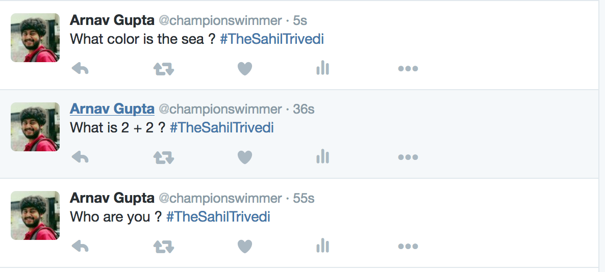

# TwitterBot

A twitter bot which tweets back answer to your question asked with **#TheSahilTrivedi**.  

## Components and Technology

1. Node.js/Express.js for server side scripts.
2. Wolfram alpha API.

## Running Locally

```
git clone git@github.com:SahilTrivedi/TwitterBot
cd TwitterBot
npm install
npm start
```
Your app should now be running on [localhost:5000](https://localhost:5000)

## Screenshots


